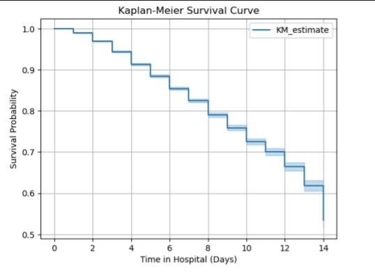
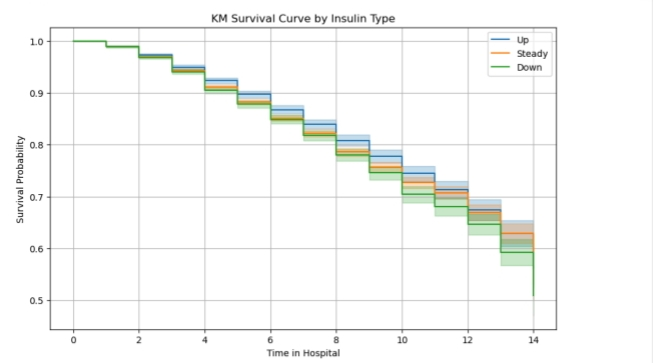
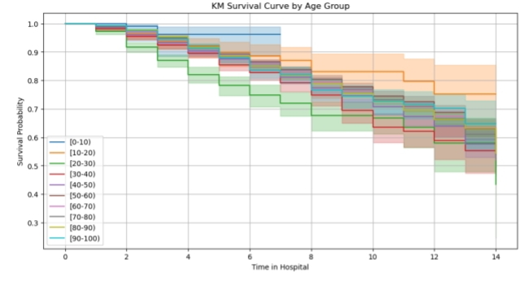
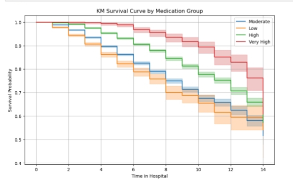

# SURVIVAL-ANALYSIS-ON-DIABETIC-READMISSION

## TABLE OF CONTENTS  

[Project Overview](#-project-overview)

[Description](#-description)  

[Problem Statement](#-problem-statement)  

[Project Objective](#-project-objective)  

[Key Areas Analyzed](#-key-areas-analyzed)  

[Data Source](#-data-source)  

[Dataset Description](#-dataset-description)  

[Tools](#-tools)  

[Methodology](#-methodology)  

[Data Cleaning](#-data-cleaning)  

[Exploratory Data Analysis (EDA)](#-exploratory-data-analysis-eda)  

[Statistical Insights and Data Visualization](#-statistical-insights-and-data-visualization)  

[Recommendation](#-recommendation)  

[Acknowledgement](#-acknowledgement)  

[Contact](#-contact)  

## 📖 Project Overview  

This project explores **time-to-event** data using **survival analysis** to investigate hospital readmission patterns among **diabetic patients**. Using **Kaplan-Meier estimators**, **log-rank tests**, and **the Cox Proportional Hazards Model**, we identify key factors contributing to early readmissions.

## 📌 Description

**Survival analysis** is applied to diabetic US-hospital data for years **1999-2008** to study the duration until a patient is readmitted. The focus is on determining whether characteristics such as **insulin use**, **age**, and **medication count** affect **readmission time**.

## ❓ Problem Statement

Hospital readmission within 30 days is a major concern in diabetic care, indicating potential issues in patient management. Understanding the survival patterns of diabetic patients and identifying predictors of early readmission can improve care planning.

## 🎯 Objective

This project aim to:

1️⃣ Estimate survival times of diabetic patients

2️⃣ Test differences in survival between groups using log-rank tests

3️⃣ Assess the impact of variables using Cox regression 

4️⃣ Check proportional hazards assumptions

## 🔍 Key Areas Analyzed

1️⃣ Kaplan-Meier survival curves by:

  - Age group
    
  - Insulin usage
    
  - Medication group
    
2️⃣ Log-rank tests for group comparison
   
3️⃣ Cox Proportional Hazards Model (with and without stratification)  

4️⃣ Statistical assumption checking

## 🗃️ Data Source

The dataset was obtained from the **UCI Machine Learning Repository**.

Name: **Diabetes 130-US hospitals for years 1999–2008**

Records: **101,766** diabetic hospital encounters

Link to the dataset: https://archive.ics.uci.edu/ml/datasets/diabetes+130-us+hospitals+for+years+1999-2008

## 📂 Dataset Description  

The dataset contains demographic information, lab results, and hospital outcomes for diabetic patients.

- **Total Records**: 101,766  

- **Initial Columns**: 50
 
For this project, the key variables used include:  

- **readmitted**: Whether the patient was readmitted within 30 days  

- **time_in_hospital**: Number of days spent in the hospital  

- **age**: Patient age group
  
- **insulin**: Insulin usage pattern
  
- **num_medications**: Number of medications prescribed

## 🛠️ Tools Used

- **Language**: Python

- **Libraries**: pandas, numpy, matplotlib, Seaborn, lifeline

## 📒 Methodology  

1️⃣ Import and clean dataset  
2️⃣ Define event and duration variables  
3️⃣ Encode categorical features and group medications  
4️⃣ Plot Kaplan-Meier curves and conduct log-rank tests  
5️⃣ Fit and validate Cox Proportional Hazards models  
6️⃣ Stratify by med_group to handle assumption violations

## 🧹 Data Cleaning  

To ensure data quality and suitability for survival analysis, several preprocessing steps were performed:

### 1️⃣ Variable Selection  
Only variables relevant to the survival analysis were retained from the original dataset containing 50 columns. The selected variables were:

- age
- time_in_hospital
- num_lab_procedures
- num_medications 
- number_diagnoses
- insulin
- readmitted 

✅ This step reduced the dataset to a focused subset of **7 key features** for time-to-event modeling.

### 2️⃣ Check for Missing Values  
A missing value assessment was conducted across the selected columns.

✅ **No missing values** were detected in the final filtered subset used for survival analysis.

### 3️⃣ Remove Duplicates  
Duplicate entries can bias model estimates and inflate sample size.

- A check revealed **3,877 duplicate rows**.
  
- All duplicate rows were removed to ensure each patient encounter was uniquely represented.

✅ Final data had **no remaining duplicates**.

### 4️⃣ Filter Invalid or Unknown Categories  
Certain values were invalid or non-informative for modeling:

- Rows with **invalid or unknown ag values** (e.g., **?**) were removed.  

- The **insulin variable** initially included non-standard values like **No**
 
✅ The dataset was filtered to keep only valid insulin usage types:  
 **Up**, **Down**, **Steady**.

### 5️⃣ Define Event and Duration for Survival Modeling  

Two critical columns were created for survival analysis:

- **event**: Indicates whether the patient was readmitted within 30 days  
  - **event = 1** if **readmitted == '<30'**
  - **event = 0** if **readmitted == No or >30**

- **duration**: Time spent in hospital, used as the survival time  
  - **duration = time_in_hospital**

✅ These columns allowed modeling of time-to-event outcomes.

### 6️⃣ Categorical Variable Transformation  

- The **age variable** was stored in ranges like **[60-70)**, so it was converted into an **ordered categorical variable** to preserve group structure during modeling and plotting.
  
- The custom order was defined as:  
  [0-10), [10-20), [20-30), [30-40), [40-50), [50-60), [60-70), [70-80), [80-90), [90-100)
  
### 7️⃣ Medication Grouping  

To analyze the effect of medication usage more meaningfully, the continuous variable **num_medications** was converted into **categorical bins** to form a new column **med_group**:

- **Low**: 0–10 medications
- **Moderate**: 11–20
- **High**: 21–40  
- **Very High**: 41 and above  

✅ This grouping allowed for better interpretation in visualizations and Cox modeling.

### ✅ Final Dataset Summary  

| Step                         | Result            |
|------------------------------|-------------------|
| Initial Rows                 | 101,766           |
| After removing duplicates    | 97,889            |
| After filtering and cleaning | 54,383            |
| Final Columns                | 10                |

The dataset was now clean, well-structured, and ready for **exploratory data analysis** and **survival modeling**.
## 📈 EXPLORATORY DATA ANALYSIS (EDA)

### 📊 Descriptive Statistics

The dataset captures patient-level information on hospital stay, medications, insulin usage, and readmission outcomes, providing rich insights into the risk factors for early hospital return.

- **Mean number of medications**: 16  
- **Standard deviation of medications**: 8.12  
- **Minimum medications prescribed**: 1  
- **25% (Q1)**: 10  
- **50% (Median)**: 16  
- **75% (Q3)**: 21  
- **Maximum medications prescribed**: 81  

- **Mean time in hospital**: 4.7 days  
- **Standard deviation**: 3.4 days  
- **Minimum**: 1 day  
- **Maximum**: 14 days

1️⃣ **Medication count** ranged from **1 to 81**, with a **median of 16**, showing that half of the patients were prescribed more than 16 medications, reflecting polypharmacy common in chronic conditions like diabetes.

2️⃣ The **average number of medications** was **16**, with 75% of patients prescribed up to **21 medications**, suggesting a moderate-to-high treatment burden.

3️⃣ The **average hospital stay** was approximately **4.7 days**, with most patients staying less than a week. Only a few had extended stays up to **14 days**, which could indicate complications or comorbidities.

4️⃣ The **interquartile range** (10 to 21 meds) suggests that **50%** of patients were prescribed between **10 and 21 medications**, offering a baseline for grouping medication levels (Low–Very High).

5️⃣ Most patients were **not readmitted within 30 days**, but a meaningful subset had early readmissions setting the stage for analyzing the influence of age, insulin usage, and medication group on survival probability.

## 📊 Statistical Insights and Data Visualization  

## 📉 Kaplan-Meier Survival Curves
Kaplan-Meier (KM) estimators were used to visualize the probability of **not being readmitted within 30 days** after hospitalization among diabetic patients. These curves help us understand how long patients stay "readmission-free" and how different variables impact that duration.

### 1️⃣ Overall Survival Curve (All Patients)
This Kaplan-Meier curve shows the **overall survival probability** across all patients in the dataset, without dividing them into subgroups.

- The survival probability starts at 1 (100%) and gradually decreases over time.
- A noticeable drop occurs within the first few days, indicating that **early readmission is fairly common**.
- Most patients were **not readmitted** within 30 days, as shown by the curve leveling off toward the end.

 **Interpretation**: While the overall risk of readmission is moderate, a subset of patients is vulnerable to being readmitted shortly after discharge. This supports the need for identifying high-risk groups using additional variables.
 
 ### 2️⃣ Survival Curve by Insulin Type
This curve compares survival probabilities based on insulin usage: **Up**, **Down**, and **Steady**.

- Patients with **Steady insulin** had the **highest survival probability**.
- Those with **Up insulin changes** experienced the **steepest decline**, meaning they were readmitted sooner.
- Patients on **Down insulin** fell in between.

 **Interpretation**: Patients whose insulin dosage was increased (Up) might be undergoing more severe diabetes episodes, leading to early readmissions.

 ### 3️⃣ Survival Curve by Age Group
This KM curve divides patients into **age brackets** (e.g., [20–30), [30–40), ..., [90–100)).

- **Younger age groups** had **higher survival probabilities**.
- The **elderly (especially 80+)** were more likely to be readmitted early.

**Interpretation**: Age significantly impacts readmission risk. Older patients often have multiple comorbidities, reduced recovery capacity, or challenges with managing their medications post-discharge.

### 4️⃣ Survival Curve by Medication Group

Patients were grouped based on the number of medications prescribed:
- **Low**: 0–10 medications
- **Moderate**: 11–20
- **High**: 21–40
- **Very High**: 41+

 

- The **‘Very High’ group** showed the **highest survival**, suggesting robust medical management.
- The **‘Low’ group** had the **lowest survival**, which may reflect under-treatment or lack of follow-up care.

**Interpretation**: Polypharmacy (taking many medications) may sometimes be protective if it reflects better chronic disease management and adherence to treatment.

## 📊 Log-Rank Test Results

To compare the survival curves between different groups, **Log-Rank tests** were performed. This statistical test checks whether the differences in survival are **statistically significant**.

### ✅ Summary of Results

| Variable      | Chi-Square (χ²) | p-value    | Interpretation                                |
|---------------|------------------|------------|-----------------------------------------------|
| **Insulin**   | 19.31            | p < 0.05   | Significant survival differences by insulin type |
| **Age**       | 124.43           | p < 0.05   | Survival probability differs significantly across age groups |
| **Med Group** | 729.34           | p < 0.05   | Strong evidence that medication level affects readmission timing |

### Interpretation:

- Since all **p-values** are less than **0.05**, the survival differences between groups are **statistically significant**.

- This means that:
  
- Patients with different **insulin usage patterns** have different risks of early readmission.

- **Age** significantly affects how long patients stay out of the hospital.

- The number of **medications prescribed** is linked to readmission timing.

These findings support what we observed in the Kaplan-Meier plots survival patterns differ meaningfully across groups.

## ⚙️ Cox Proportional Hazards Model

To analyze the factors that influence the time to readmission among diabetic patients, a **Cox Proportional Hazards model** was fitted using 54,383 observations. The model estimated **hazard ratios (HRs)** for patient characteristics such as age, insulin usage, and medication level.

HR > 1, **increased risk** of the event

HR < 1, **decreased risk** of the event

HR = 1, **no effect of risk** of the event

### 1️⃣ Initial Cox Model (Before Stratification)

The initial model included:
- **age** group  with (0-10 as the reference)
- **insulin pattern** (Down, Up, Steady with down as the reference)  
- **med_group** (Low, Moderate, High, Very High  with Low as the reference)

### Key Results

| Variable               | Hazard Ratio (HR) | 95% CI           | p-value   | Significance |
|------------------------|-------------------|------------------|-----------|--------------|
| Age [20–30)            | 5.21              | 1.66 – 16.31     | < 0.005   | ✅ Significant |
| Age [30–40)            | 3.85              | 1.23 – 12.01     | < 0.005   | ✅ Significant |
| Age [40–50)            | 3.54              | 1.14 – 11.03     | < 0.005   | ✅ Significant |
| Age [50–60)            | 3.13              | 1.01 – 9.75      | < 0.005   | ✅ Significant |
| Age [60–70)            | 3.29              | 1.06 – 10.23     | < 0.005   | ✅ Significant |
| Age [70–80)            | 3.15              | 1.01 – 9.78      | < 0.005   | ✅ Significant |
| Age [80–90)            | 3.08              | 0.99 – 9.56      | < 0.005   | ✅ Significant |
| **Age [90–100)**       | **2.96**          | **0.94 – 9.27**  | **0.06**  | ❌ Not significant |
| Insulin (Steady)       | 0.87              | 0.82 – 0.92      | < 0.005   | ✅ Significant |
| Insulin (Up)           | 0.87              | 0.81 – 0.93      | < 0.005   | ✅ Significant |
| Med Group (Moderate)   | 0.71              | 0.66 – 0.76      | < 0.005   | ✅ Significant |
| Med Group (High)       | 0.41              | 0.38 – 0.44      | < 0.005   | ✅ Significant |
| Med Group (Very High)  | 0.23              | 0.19 – 0.28      | < 0.005   | ✅ Significant |

**Interpretation**:
- Most age groups, insulin types, and medication levels were significantly associated with early readmission.
- Patients with **higher medication levels** or on **Steady insulin** had significantly **lower risk** of being readmitted.
- The **age group [90–100)** had a high hazard ratio but was **not statistically significant** (p = 0.06).

## 2️⃣ Proportional Hazards Assumption Test

After fitting the Cox model, the **Proportional Hazards (PH) assumption** was tested using **Schoenfeld residuals**. This test checks if the effect of each variable remains **constant over time**, a key requirement for valid Cox regression.

### 📊 Summary of Schoenfeld Residuals Test

| Variable               | Test Type | χ² Statistic | p-value   | PH Assumption |
|------------------------|-----------|--------------|-----------|---------------|
| age_[10–20)            | KM        | 0.42         | 0.52      | ✅ Passed      |
| age_[20–30)            | KM        | 0.39         | 0.53      | ✅ Passed      |
| age_[30–40)            | KM        | 0.06         | 0.80      | ✅ Passed      |
| age_[40–50)            | KM        | 0.09         | 0.77      | ✅ Passed      |
| age_[50–60)            | KM        | 0.04         | 0.84      | ✅ Passed      |
| age_[60–70)            | KM        | 0.07         | 0.80      | ✅ Passed      |
| age_[70–80)            | KM        | 0.03         | 0.87      | ✅ Passed      |
| age_[80–90)            | KM        | 0.02         | 0.89      | ✅ Passed      |
| age_[90–100)           | KM        | 0.08         | 0.77      | ✅ Passed      |
| insulin_Steady         | KM        | 0.13         | 0.72      | ✅ Passed      |
| insulin_Up             | KM        | 0.13         | 0.72      | ✅ Passed      |
| **med_group_Moderate** | KM        | 5.66         | 0.02      | ❌ Violated    |
| **med_group_High**     | KM        | 86.85        | <0.005    | ❌ Violated    |
| **med_group_Very High**| KM        | 125.86       | <0.005    | ❌ Violated    |

 **Note**: The same pattern was observed in the **rank test**, which confirmed that **med_group** violates the PH assumption across all levels.

### Interpretation

- ✅ **All age groups** and **insulin types** passed the PH assumption test, their effects on readmission risk were constant over time.
- ❌ **Medication group (**med_group**) violated the PH assumption**, indicating that the impact of medication level **changes over time**.

This made the initial model **invalid** for interpreting the effect of medication levels.

- Since this violates a core assumption of the Cox model, we addressed it by using a **Stratified Cox Model**, allowing each medication group its own baseline hazard.

- ## 3️⃣ Final Stratified Cox Model Results

After detecting a violation of the proportional hazards assumption by the med_group variable, a **Stratified Cox Proportional Hazards model** was fitted stratifying med_group to allow each level of medication to have its own baseline hazard.

This model includes:
- age group  
- insulin usage (Up, Steady)  
- med_group handled through stratification (not estimated as a covariate)

### ✅ Key Output Summary

| Variable         | HR (exp(coef)) | 95% CI            | p-value   | Significance | Interpretation |
|------------------|----------------|-------------------|-----------|--------------|----------------|
| Age [10–20)       | 2.31           | 0.71 – 7.51       | 0.16      | ❌ Not significant | Slightly higher risk, but not statistically meaningful |
| Age [20–30)       | 6.02           | 1.92 – 18.86      | < 0.005   | ✅ Significant | 502% higher risk of readmission |
| Age [30–40)       | 4.46           | 1.43 – 13.94      | 0.01      | ✅ Significant | 346% higher risk |
| Age [40–50)       | 4.10           | 1.32 – 12.79      | 0.01      | ✅ Significant | 310% higher risk |
| Age [50–60)       | 3.56           | 1.14 – 11.08      | 0.03      | ✅ Significant | 256% higher risk |
| Age [60–70)       | 3.77           | 1.21 – 11.75      | 0.02      | ✅ Significant | 277% higher risk |
| Age [70–80)       | 3.67           | 1.18 – 11.42      | 0.02      | ✅ Significant | 267% higher risk |
| Age [80–90)       | 3.65           | 1.17 – 11.38      | 0.03      | ✅ Significant | 265% higher risk |
| Age [90–100)      | 3.64           | 1.16 – 11.43      | 0.03      | ✅ Significant | 264% higher risk |
| Insulin (Steady)  | 0.89           | 0.84 – 0.94       | < 0.005   | ✅ Significant | 11% reduced risk of readmission |
| Insulin (Up)      | 0.85           | 0.80 – 0.92       | < 0.005   | ✅ Significant | 15% reduced risk of readmission |

### Interpretation

- All age groups from **20–30 to 90–100** showed a **significant increase** in risk of early readmission, compared to the baseline age group.
- **Older patients (especially 90+)** had **over 3.6× the risk** of readmission compared to the youngest reference group.
- Both **insulin groups** (Steady, Up) showed **statistically significant reductions** in risk, indicating that stable or increasing insulin usage may be protective.
- **med_group** was **not included as a covariate** in this model because it was used as a **stratification variable** to correct for assumption violation.

✅ The model now satisfies the proportional hazards assumption and provides **valid, interpretable results** for all included predictors

## 📏 Model Evaluation Metrics

To assess the performance of the stratified Cox Proportional Hazards model, key statistical metrics were computed:

#### Model Evaluation summary
| Metric                           | Value         |
|----------------------------------|---------------|
| **Concordance Index (C-index)**  | 0.53          |
| **Partial AIC**                  | 118,583.91    |
| **Log-Likelihood Ratio Test**    | 97.94 (df = 11) |
| **−log₂(p)**                     | 50.96         |

## ✅ Recommendations

Based on the findings from the survival analysis, the following recommendations are proposed:

1️⃣ **Enhanced Monitoring for Older Patients**  
Patients aged 60 and above had significantly higher hazard ratios for early readmission. Hospitals should implement age-specific discharge plans and post-discharge follow-up strategies.

2️⃣ **Prioritize Stable Insulin Management**  
Patients with "Steady" or "Up" insulin usage patterns had a lower risk of readmission. Consistent insulin regulation should be encouraged, and sudden changes should trigger closer monitoring.

3️⃣ **Stratify Care Based on Medication Load**  
The number of medications prescribed was strongly associated with survival. Patients on fewer medications (Low/Moderate) may need more attention during discharge planning and follow-up, as they had higher risk.

4️⃣ **Educate Patients on Polypharmacy Management**  
Since medication complexity plays a role in readmission, diabetic patients should receive medication counseling to ensure adherence, understand interactions, and avoid mismanagement.

## 🙏 Acknowledgement  
Thanks to the [UCI Machine Learning Repository](https://archive.ics.uci.edu/ml/datasets/diabetes+130-us+hospitals+for+years+1999-2008) for making this valuable dataset available for research.

## 📞 Contact  
Created by **Ajirola Amudat**  

🔗 [LinkedIn](https://www.linkedin.com/in/ajirola-amudat-a-3083882b2

📫 For collaboration or inquiries: [Send a message on LinkedIn](https://www.linkedin.com/in/amudat-ajirola)

